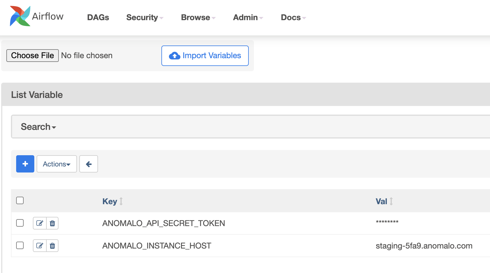
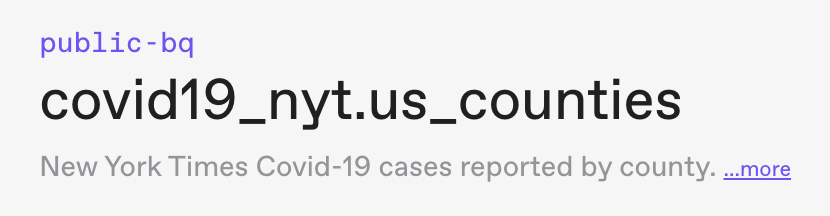

# Apache Airflow Provider for Anomalo
A set of native Airflow operators for [Anomalo](https://www.anomalo.com/)

### Compatibility
These operators were created and tested with
* Python 3.6-3.8
* Airflow 2.2+
* Anomalo python client 0.0.6

### Airflow Setup
1. Create and store 2 Anomalo env variables for authentication within Airflow
2. Navigate in Airflow to Admin > Variables (URL path append /variable/list) and add 2 new records with Key named `ANOMALO_API_SECRET_TOKEN` and `ANOMALO_INSTANCE_HOST`


## Installation

1. Install Anomalo's python client on Airflow server via `pip install anomalo`
2. Copy the 2 operator `.py` files to either the `/dags` or `/include` directory of your Airflow installation
3. Copy the example DAG file to the `/dags` directory of your Airflow installation
4. Restart Airflow

## Usage

1. Obtain Anomalo table name from GUI. For example
   
   would be `public-bq.covid19_nyt.us_counties`

2. This package includes 2 different operators
   1. Run checks
      * Inputs - Anomalo table + default timeout limit for checks to finish before failure (defaults to 15m)
      * Action - Run all configured checks for this table on the previous date. Waits until all runs are completed within timeout limit before Airfow step concludes
   2. A result checker
      * Inputs - Anomalo table + list of any variation of the categories of checks that must pass ['data_freshness','data_volume','metric','rule','missing_data','anomaly']
      * Action - Obtains all completed checks for this table on the previous date. If all checks from the inputted list of categories complete with a Pass, Airflow step completes successfully. If any single check from inputted list of categories fail, Airflow DAG throws an exception and immediately fails

3. In your DAG, don't forget to import the 2 new modules
   ```
   from anomalo_runchecks import AnomaloRunCheck
   from anomalo_passfail import AnomaloPassFail
   ```
   See `anomalo_dag_example.py` for usage example

## Help

Email anthony@anomalo.com